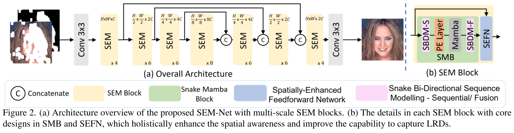
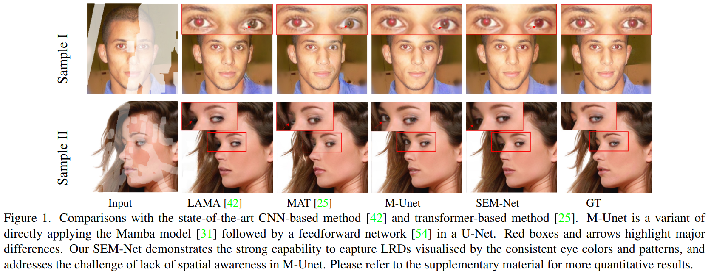
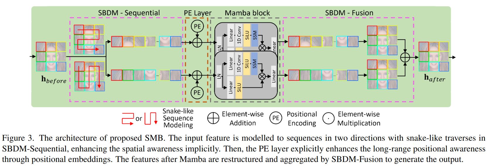
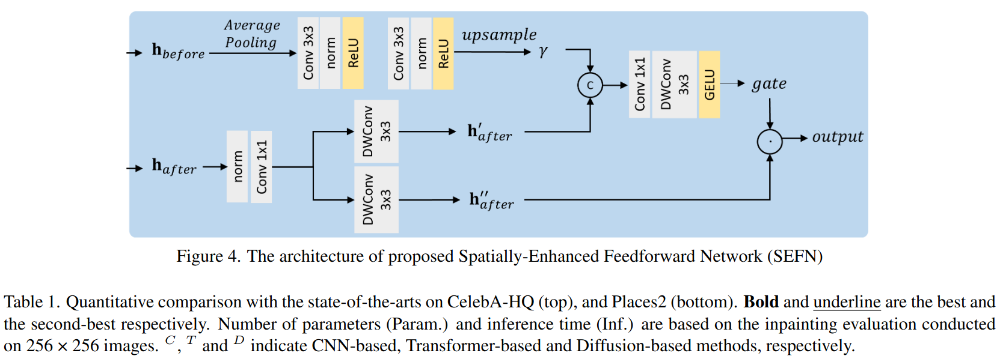

# SEM-Net: Efficient Pixel Modelling for image inpainting with Spatially Enhanced SSM (WACV 2025)
========================================================================================

Image inpainting aims to repair a partially damaged image based on the information from known regions of the images. \revise{Achieving semantically plausible inpainting results is particularly challenging because it requires the reconstructed regions to exhibit similar patterns to the semanticly consistent regions}. This requires a model with a strong capacity to capture long-range dependencies. Existing models struggle in this regard due to the slow growth of receptive field for Convolutional Neural Networks (CNNs) based methods and patch-level interactions in Transformer-based methods, which are ineffective for capturing long-range dependencies. Motivated by this, we propose SEM-Net, a novel visual State Space model (SSM) vision network, modelling corrupted images at the pixel level while capturing long-range dependencies (LRDs) in state space, achieving a linear computational complexity. To address the inherent lack of spatial awareness in SSM, we introduce the Snake Mamba Block (SMB) and Spatially-Enhanced Feedforward Network. These innovations enable SEM-Net to outperform state-of-the-art inpainting methods on two distinct datasets, showing significant improvements in capturing LRDs and enhancement in spatial consistency. Additionally, SEM-Net achieves state-of-the-art performance on motion deblurring, demonstrating its generalizability. Our source code is available in supplementary materials.

--------------------

## News
- [x] Paper Download 
- [x] Training Code
- [x] Pre-trained Models


--------------------
Paper Download:[SEM-Net: Efficient Pixel Modelling for image inpainting with Spatially Enhanced SSM](https://arxiv.org/abs/2411.06318)

**Overview**
--------------------




**Motivation**
--------------------


As illustrated in Sample II of Fig. 1, a vanilla SSM model shows positional drifting of the inpainted left eye (upper than the right eye). This insight introduces two key challenges: (i) how to maintain the continuity and consistency of pixel adjacency for pixel-level dependencies learning while processing the SSM recurrence; and (ii) how to effectively integrate 2D spatial awareness to the predominant linear recurrent-based SSMs.

**Snake Mamba Block (SMB)**
--------------------



** Spatially-Enhanced Feedforward Network (SEFN)**
--------------------



**Dataset**
--------------------
For the full CelebA-HQ dataset, please refer to http://mmlab.ie.cuhk.edu.hk/projects/CelebA.html

For the full Places2 dataset, please refer to http://places2.csail.mit.edu/download.html

For the irrgular mask dataset, please refer to http://masc.cs.gmu.edu/wiki/partialconv

Please use `script/flist.py` to create `.flist` file for training and testing.


**Initialization**
--------------------
* Clone this repo:
```
git clone https://github.com/ChrisChen1023/SEM-Net
cd SEM-Net-main
```


**Pre-trained model**
--------------------
We released the pre-trained model 
[Google Drive](https://drive.google.com/drive/folders/1zlFqhm9JMYs4J0WaAHPSL_N1QkL8q479?usp=drive_link)


For each pretrained model:

[CelebA-HQ](https://drive.google.com/drive/folders/1L-Tt3mTgbJ_8Ki8jQIZE6xmddhHNl3YN?usp=drive_link)

[Places2](https://drive.google.com/drive/folders/1sgJRu-Vf6u6taZY-RpY8cFXRAH09i4fu?usp=drive_link)


**Getting Started**
----------------------
[Download pre-trained model]
Download the pre-trained model to `./checkpoints`

[Data Preparation]
Download the Datasets, use `script/flist.py` to create `.flist` file for training and testing.
Set your own `config.yml` with the corresponding flist paths at 'TEST_INPAINT_IMAGE_FLIST', 'TRAIN_INPAINT_IMAGE_FLIST', 'T_MASK_FLIST' and 'TEST_MASK_FLIST'. Set the `--MAKS 3` for the mixed mask index (for training),  and  `--MAKS 6` for the fixed mask index (for testing).

run:
```
python train.py
```
For testing, in `config.yml`, set the `--MAKS 6` for the fixed mask index, then run:
```
python test.py
```


**Citation**

If you find this work helpful, please cite us.
```
@article{chen2024sem,
  title={SEM-Net: Efficient Pixel Modelling for Image Inpainting with Spatially Enhanced SSM},
  author={Chen, Shuang and Zhang, Haozheng and Atapour-Abarghouei, Amir and Shum, Hubert PH},
  journal={arXiv preprint arXiv:2411.06318},
  year={2024}
}


